# Get started

## Introduction
In this lab you will go trhough the first steps to start the workshop.

### Objectives

In this lab, you will be guided through the following tasks:
* Prepare OCI Environment for lab deployment 
* Create and connect to your trainer-vm and deploy servers 

### Prerequisites 

* You will need to deploy 5 compute instances for this workshop. **Keep this in mind** 
* The software that you are using in this workshop is trial: you are eligible to **use it for 30 days, after that you have to buy or remove it**

## Task 1: Download Material
1. Go to the link provided by your instructor, select all and download it
    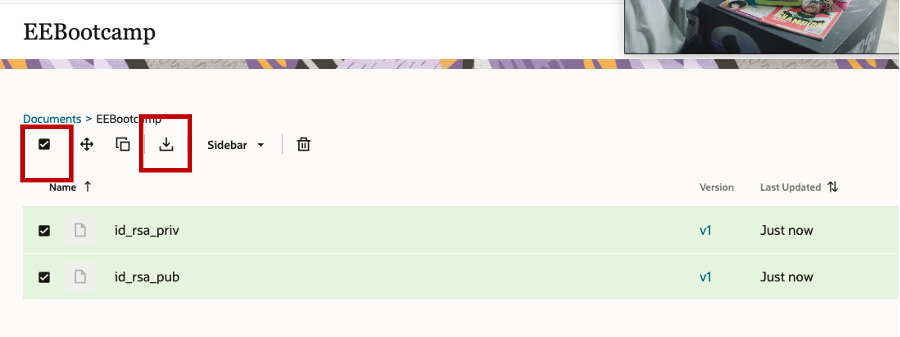

## Task 1: Create VCN 
1. Go to Menu > Networking > Virtual Cloud Network
    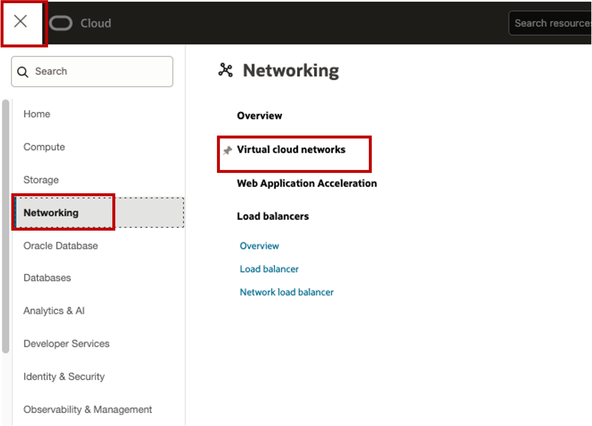

2. Click on Start VCN Wizard
    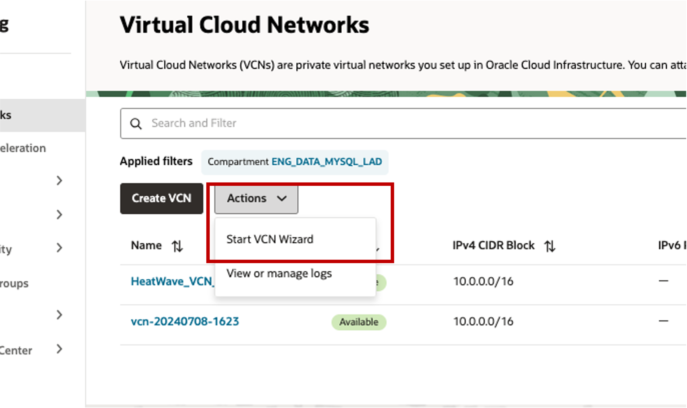

3. Assign a name and make sure you're using the right compartment
    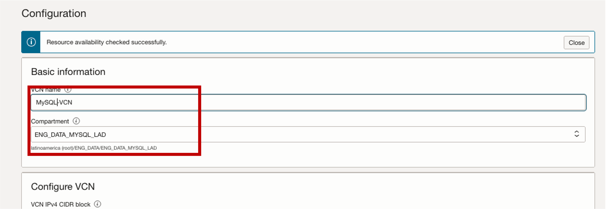

4. Click Next 
4. Click Create


## Task 2:  Create and connect to trainer-vm 
1. Go to Menu > Compute > Instances > Create Instance 
    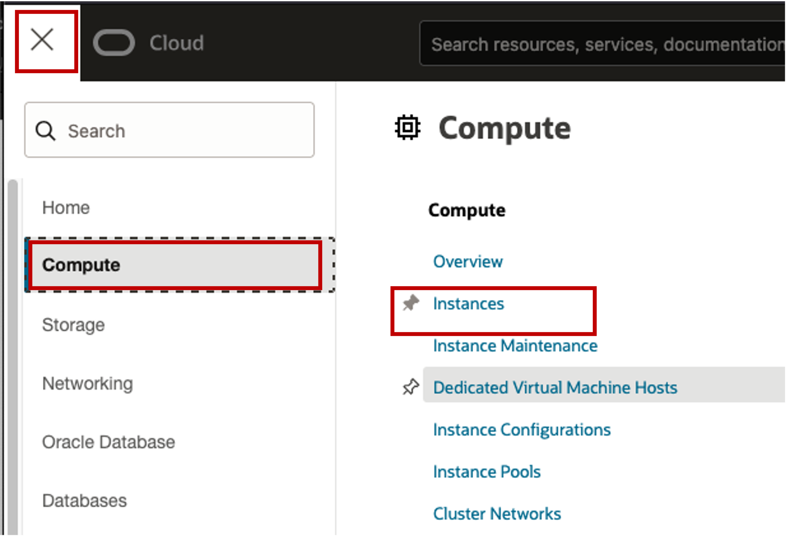

2. Assign the following name and Make sure you're using the right compartment
    ```
    <copy>trainer-vm </copy>
    ```
    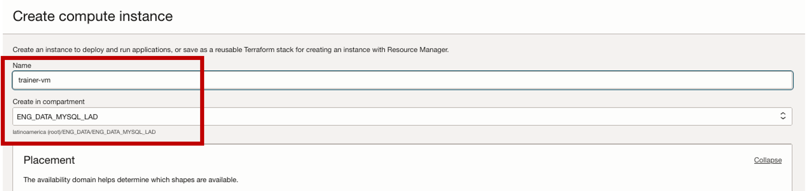

3. Assign the VCN you created earlier and verify the public subnet is assigned too
    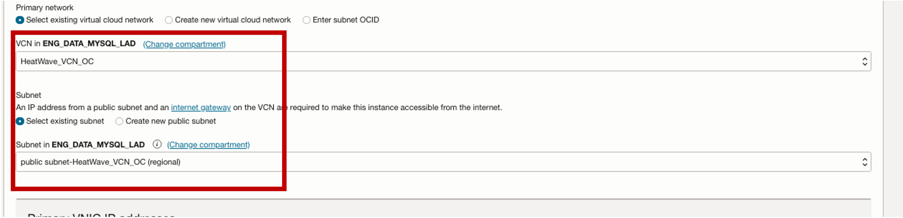

4. Select "Paste public keys" and paste the content of the file **id\_rsa\_pub** that you downloaded from the Workshop Material link provided earlier
    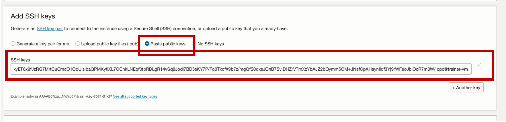
5. Click on Create
6. Once that the instance is RUNNING, open the Cloud Shell 
    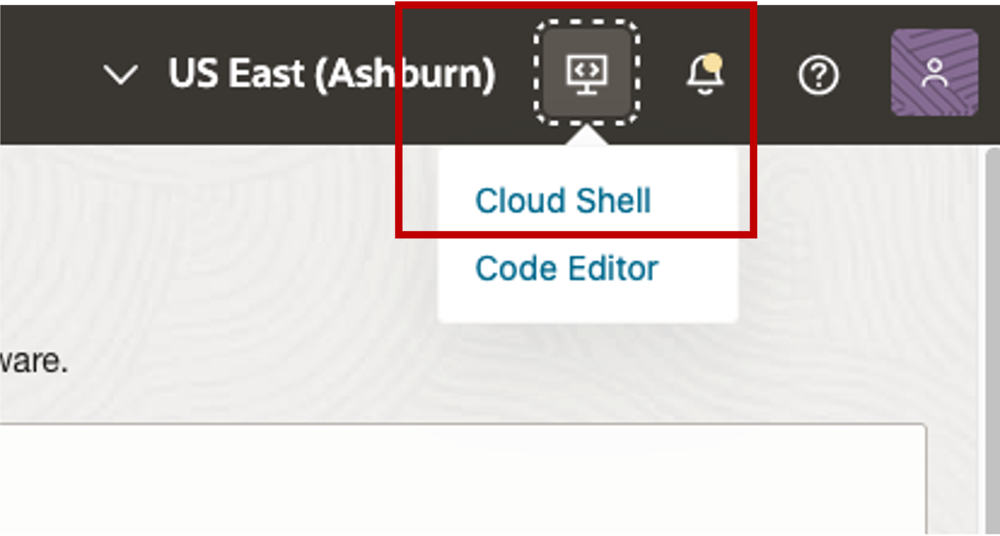

8. It can take a couple of minutes to provision, once it's done, create a file for your key and paste the content of the file **id\_rsa\_priv** that you downloaded from the Workshop Material link provided earlier

    ```
    <span style="color:green">Cloud-shell></span> <copy>mkdir .ssh </copy>
    ```

    ```
    <span style="color:green">Cloud-shell></span> <copy>nano .ssh/id_rsa_priv </copy>
    ```

10. Fix the permissions for the file
    ```
    <span style="color:green">Cloud-shell></span> <copy> sudo chmod 400 .ssh/id_rsa_priv </copy>
    ```
11. Connect to the trainer-vm, make sure to add the **Public IP** of your trainer-vm compute
    ```
    <span style="color:green">Cloud-shell></span> <copy> ssh -i .ssh/id_rsa_priv opc@<IP-trainer-vm> </copy>
    ```


## Task 3: Install OCI CLI and add a create a config file 
1. Install the OCI CLI
	```
    <span style="color:green">trainer-vm></span><copy> 
    sudo yum install python36-oci-cli -y
    </copy>
    ```
2. Create a directory called .oci 
    ```
    <span style="color:green">trainer-vm></span> <copy>mkdir /home/opc/.oci </copy>
    ```

3. On your tenancy, go to your profile 
    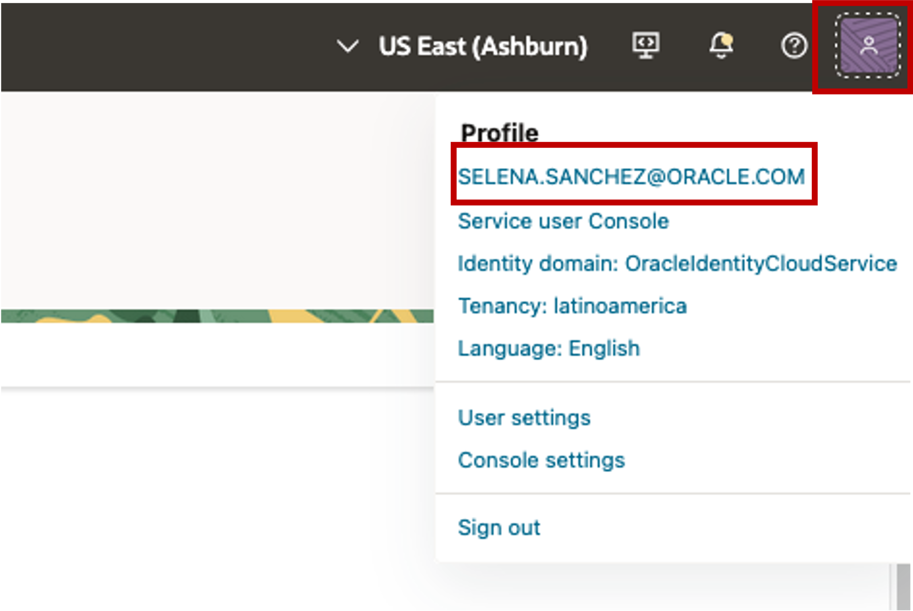

4. Click on API Keys > Add API Key
    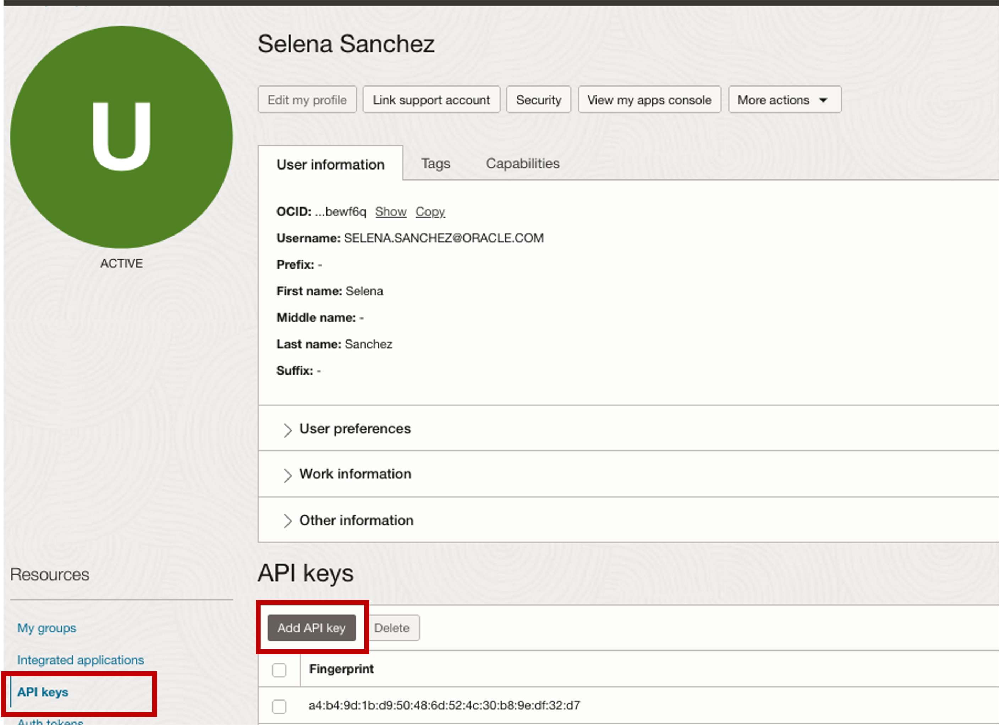

5. Download BOTH the Public and private keys and save them on a dedicated folder on your computer and copy the configuration that is shown on the pop-up window
    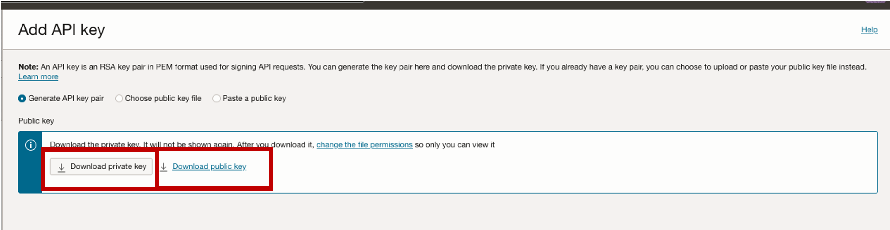
        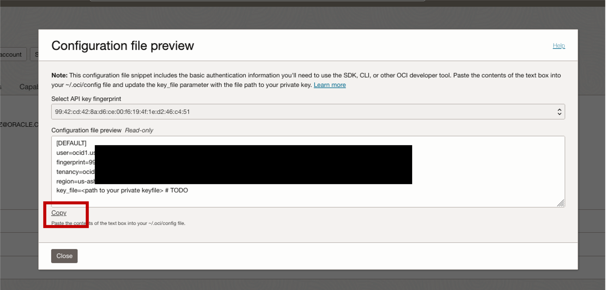

6. Create the config file 
    ```
    <span style="color:green">trainer-vm></span> <copy>mkdir /home/opc/.oci </copy>
    ```
    ```
    <span style="color:green">trainer-vm></span> <copy>nano /home/opc/.oci/config </copy>
    ```
7. Paste here the info you copied on step 5, delete the higlited portion, and replace it with the following

    ```
    <span style="color:green">trainer-vm></span> <copy>/home/opc/.oci/privapikey.pem </copy>
    ```
    It should look like this:
    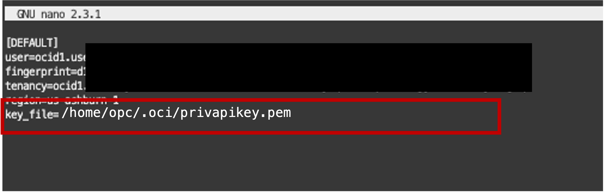

    Press Ctrl + O, then ENTER and then Ctrl + X to save and exit

8. Create a file for your key 
    ```
    <span style="color:green">trainer-vm></span> <copy>nano /home/opc/.oci/privapikey.pem </copy>
    ```

    Open the **private** key you downloaded earlier, the one that doesn't contain "public" at the end
    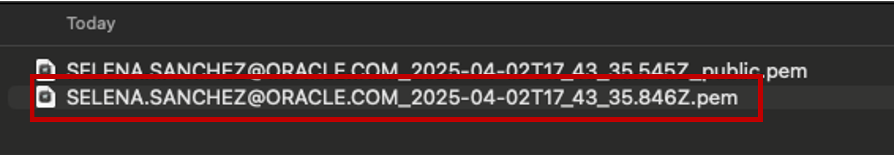

9. Paste the content of your **private key** in to the file you are creating, it should look lie this:
    

    Press Ctrl + O, then ENTER and then Ctrl + X to save and exit
10. Fix the permissions for the file
    ```
    <span style="color:green">trainer-vm></span> <copy> chmod 400 /home/opc/.oci/privapikey.pem </copy>
    ```


## Task 4: Download script and configure the trainer-vm
1. Use wget to download the configuration script 
    ```
    <span style="color:green">trainer-vm></span> <copy> wget <LINK-provided-by-instructor> </copy>
    ```
2. Modify the file and make it executable
    ```
    <span style="color:green">trainer-vm></span> <copy> sudo chmod +x configure_essential_labs.sh</copy>
    ```

## Task 5: Create app-srv y mysql servers referenced on the labs
1. Execute it 
    ```
    <span style="color:green">trainer-vm></span> <copy> ./configure_essential_labs.sh</copy>
    ```

2. Wait for a blue screen to show, and select option 2
    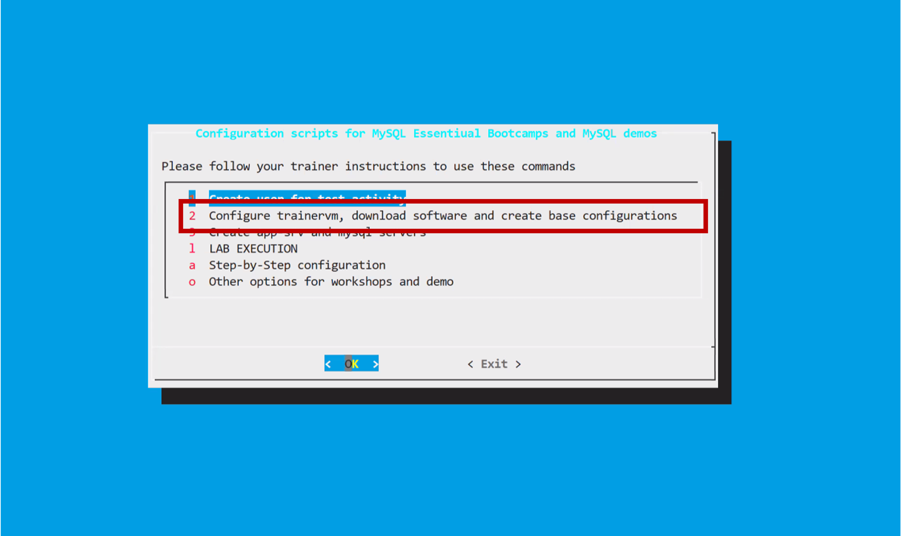
3. Select the time zone that best suits you (to select it, you have to click on the parenthesis)
    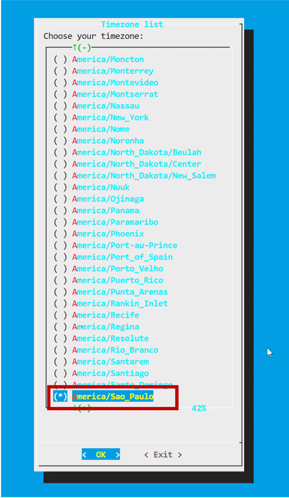
4. **don't close this window** Wait for it to finish, **when prompted to CONTINUE, click Enter**

5. You'll see the blue Window again, select option 3 this time
    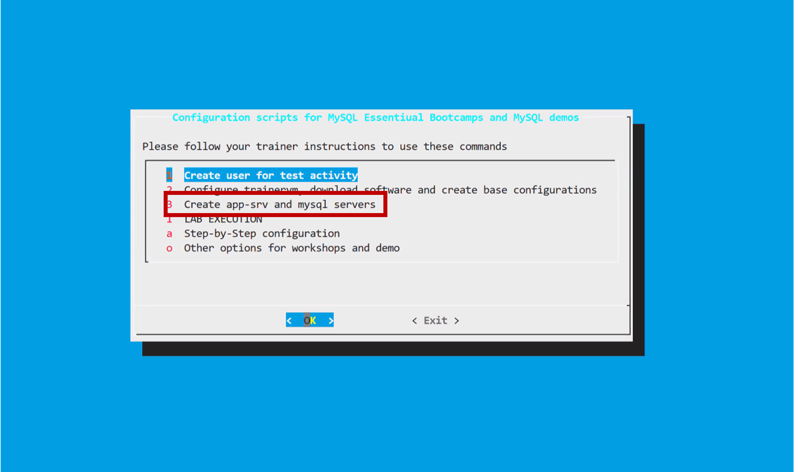

6. When asked, insert **1** on the number of sets you want to create, and accept the creation of 3 servers.
7. **don't close this window** Wait for it to finish.


## Task 6: Verify connection to app-srv

Connect with your SSH client using the public IP and the provided ssh keys, you can keep using the Cloud Shell or switch to another client.

1. Example of connections from Linux, MAC, Windows Powershell
	```
    <span style="color:green">shell></span><copy> ssh -i id_rsa_app-srv opc@<public_ip></copy>
    ```

    > **Note:**   For linux and Mac terminals, make sure to asign the right permissions to your key, use:
        ```
        <span style="color:green">shell></span><copy>sudo chmod 600 id_rsa_app-srv</copy>
        ```

* Example of connections using PUTTY can be found in the addendum 1 of this workshop.


## Acknowledgements
* **Author** - Marco Carlessi, Principal Sales Consultant
* **Contributors** -  Perside Foster, MySQL Solution Engineering, Selena Sánchez, MySQL Solutions Engineer, Cristian Aguilar, MySQL Solutions Engineer, Ana Paula Araujo, MySQL Solutions Engineer
* **Last Updated By/Date** - Selena Sánchez, MySQL Solution Engineering, April 2025
